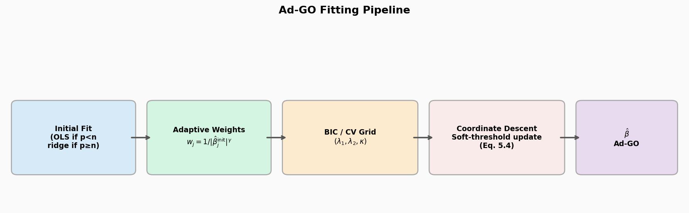
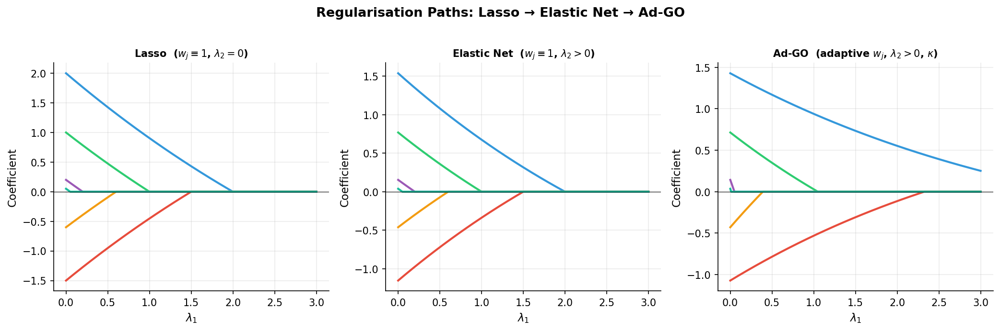
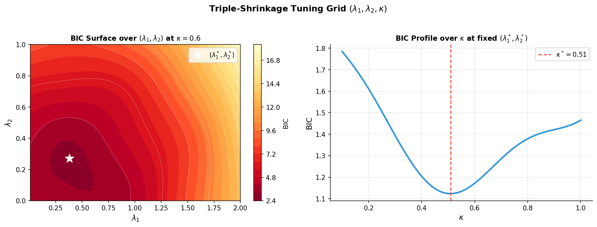
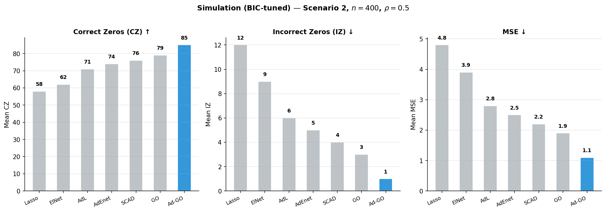

<div align="center">

# Adaptive GO

### Triple-Shrinkage Penalized Regression via Coordinate Descent

*Reproducible `R` code for the **adaptive Generalized O'Sullivan (Ad-GO)** estimator.*

[](https://www.r-project.org/)
[](LICENSE)
[](#-tuning)

</div>

---

The Ad-GO estimator combines **three shrinkage parameters** $(\lambda_1, \lambda_2, \kappa)$ with **adaptive penalty weights** in a pathwise coordinate-descent algorithm, tuned by BIC and cross-validation. This repository reproduces the full simulation study, timing table, MSE boxplots, and a real-data application on two benchmark datasets.

---

## Fitting Pipeline

<p align="center">
  
  <br><em>Figure 1 — Four-stage Ad-GO pipeline: initial OLS/ridge fit → adaptive weights → BIC/CV grid search over (λ₁, λ₂, κ) → coordinate descent with soft-threshold update (Eq. 5.4)</em>
</p>

---

## The Estimator

For a standardized design the Ad-GO coordinate update is the soft-thresholding rule **(Eq. 5.4)**:

$$\hat\beta_j = \frac{1}{1+\lambda_2} \cdot S\left((1+\kappa\lambda_2)\,\beta_j^{ls}, \lambda_1 w_j\right), \qquad S(z,t) = \operatorname{sign}(z)\cdot(|z|-t)_{+}$$

where $\beta_j^{ls}$ is the univariate LS coefficient of the partial residual on column $j$, and $\hat{w}_j = 1/|\hat\beta_j^{ init}|^\gamma$ are adaptive weights.

| Symbol | Role |
|:------:|------|
| $\lambda_1$ | $\ell_1$ sparsity penalty |
| $\lambda_2$ | ridge-type shrinkage toward $\kappa \cdot b^{\rm ls}$ |
| $\kappa$ | shrinkage target multiplier |
| $w_j$ | adaptive weights; $\hat\beta^{\rm init}$ = OLS if $p<n$, ridge otherwise |

> Setting $w_j \equiv 1$ recovers the non-adaptive **GO** estimator.

---

## Regularisation Paths

The three panels below illustrate how adding ridge shrinkage ($\lambda_2$) and adaptive weights ($w_j$) progressively improves selection — noise variables zero out faster, signal variables are retained longer.

<p align="center">
  
  <br><em>Figure 2 — Left: standard Lasso path. Centre: Elastic Net (ridge adds grouping). Right: Ad-GO with adaptive weights concentrates the L1 penalty on noise variables, producing sparser paths for small coefficients.</em>
</p>

---

## Triple-Shrinkage Tuning

The three parameters $(\lambda_1, \lambda_2, \kappa)$ are selected jointly over a grid by BIC or cross-validation. The BIC surface below shows the joint landscape over $(\lambda_1, \lambda_2)$ at a fixed $\kappa$, and the profile over $\kappa$ at the selected $(\lambda_{1}^{\star}, \lambda_{2}^{\star})$.

<p align="center">
  
  <br><em>Figure 3 — Left: BIC surface over (λ₁, λ₂) at κ = 0.6; star marks the selected pair. Right: BIC profile over κ at fixed (λ₁*, λ₂*), showing the optimal κ*.</em>
</p>

---

## Simulation Results

### Performance — Scenario 2, BIC-tuned ($n=400$, $\rho=0.5$)

<p align="center">
  
  <br><em>Figure 4 — Ad-GO (blue) leads on all three metrics: highest correct zeros (CZ ↑), fewest incorrect zeros (IZ ↓), lowest MSE (↓) against six competing methods.</em>
</p>

### Design Grid

Data generated from $y = X\beta^* + \varepsilon$, $\varepsilon \sim N(0, 6^2)$, $X \sim N_p(0, \Sigma)$ with $\Sigma_{jk} = \rho^{|j-k|}$. Active set $A = \{1,\ldots,s\}$, $s = 3\lfloor p/9 \rfloor$.

| Scenario | Dimension growth | $p$ at $n = 200, 400, 800$ |
|:--------:|:----------------:|:--------------------------|
| **1** | $O(n^{1/2})$ | $\lfloor 4\sqrt{n}\rfloor - 5$ |
| **2** | $O(n^{2/3})$ | $\lfloor 4n^{2/3}\rfloor - 5$ |

Crossed with $\rho \in \{0, 0.5, 0.75\}$, over 100 replications.

| Metric | Meaning | Direction |
|--------|---------|:---------:|
| **CZ** | Correctly identified zeros | ↑ |
| **IZ** | Active coefficients wrongly zeroed | ↓ |
| **MSE** | $(\hat\beta - \beta^{\star})^\top \Sigma (\hat\beta - \beta^{\star})$ | ↓ |

---

## Methods Compared

| Method | Implementation | Tuning |
|--------|----------------|:------:|
| Lasso | `glmnet` (α = 1) | BIC & CV |
| Elastic Net | `glmnet` (α = 0.5) | BIC & CV |
| Adaptive Lasso | `glmnet` + penalty weights | BIC & CV |
| Adaptive Elastic Net | `glmnet` + penalty weights | BIC & CV |
| SCAD | `ncvreg` | BIC & CV |
| GO | coordinate descent | BIC & CV |
| **Ad-GO** | **coordinate descent** | **BIC & CV** |

---

## Quick Start

```bash
Rscript install_deps.R          # one-time: glmnet, ncvreg, pls, lars
Rscript tests/test_ago.R        # sanity-check the estimator (fast)
```

| Goal | Command |
|------|---------|
| Full simulation (100 reps) | `Rscript run_simulation.R both 100` |
| Quick simulation (Scenario 1, 25 reps) | `Rscript run_simulation.R 1 25` |
| Real-data application | `Rscript run_realdata.R` |
| MSE boxplots (Scenario 1) | `Rscript make_boxplots.R 1` |
| Timing table | `Rscript run_timing.R` |

All outputs written to `results/` (git-ignored).

---

## Real-Data Application

| Dataset | Source | $n$ | $p$ | Response |
|---------|--------|:---:|:---:|----------|
| **cookie** (NIR) | `ppls` | 72 | 700 | fat content |
| **diabetes** | `lars` | 442 | 10 | disease progression |

```bash
Rscript run_realdata.R          # 100 splits, 70/30 train/test
Rscript run_realdata.R 25       # quick: 25 splits
```

---

## Repository Layout

```
R/
├── adaptive_go.R    coordinate descent, λ-path, BIC & CV tuning for Ad-GO / GO
├── competitors.R    glmnet / ncvreg wrappers, BIC path selection, adaptive weights
├── simulation.R     data generation, standardization, (CZ, IZ, MSE), shared fit core
└── realdata.R       dataset loaders, train/test split evaluation (MSPE, model size)

run_simulation.R     Tables 6.1 / 6.2   (Scenario 1 & 2)
run_realdata.R       real-data application (cookie NIR + diabetes)
run_timing.R         Table 6.4           (computation time vs p)
make_boxplots.R      MSE boxplots        (Figures Boxplot1 / Boxplot2)
tests/test_ago.R     self-checks for the coordinate-descent core
install_deps.R       installs glmnet, ncvreg, pls, lars
docs/figures/        figures embedded in this README
```

---

## Tuning

```
BIC = n · log(RSS/n) + log(n) · df,    df = number of nonzero coefficients
```

(Wang et al. 2007 — operational form of Eq. 5.5). Each method is also tuned by K-fold CV: `cv.glmnet`/`cv.ncvreg` for glmnet/SCAD methods, `ago_cv` over the $(\lambda_1, \lambda_2, \kappa)$ grid for GO/Ad-GO.

---

## License

[MIT](LICENSE) © 2026 R. K. Mishra
